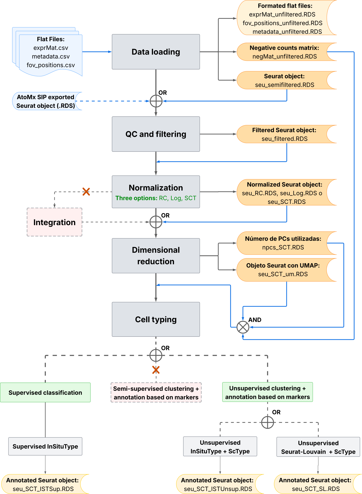

# Introduction

[CosMx™ SMI technology](https://nanostring.com/products/cosmx-spatial-molecular-imager/single-cell-imaging-overview/) is an imaged-based spatial transcriptomics technology based on ISH and fluorescence techniques, and, as such, an important step of processing its data would be processing the histology and fluorescence images to extract the expression matrix and the spatial location coordinates of cells and transcripts. However, for this project, it was decided to start the pipeline from the data obtained after segmentation and the construction of expression and localization matrices, since, this steps can be efficiently carried out in [AtoMx™ SIP](https://nanostring.com/products/atomx-spatial-informatics-platform/atomx-sip-overview/) (the data-storing platform of the SMI instrument), avoiding the need to download large amounts of image files. Additionally, if open-source alternatives are preferred, there are already pipelines available that allow this phase to be performed separately [1,2].

For the construction and structuring of this pipeline, a depth review of open-source tools, available automatic pipelines and exploration of various vignettes and practical usage examples was performed. Additionally, resources and recommendations from the manufacturer, NanoString® [3,4], as well as relevant technical documentation [5,6], were also reviewed.

Finally, special mention to the *Scratch Space Vignette: Basics of CosMx Analysis in R* [7] and the *CosMxLite vignette* [8], which where very helpful for developing this work and understanding the basics of this type of data analysis process. However, all references to these and other sources have been commented and linked on the code when needed.

# Pipeline

The proposed pipeline consists of five main phases: data loading, QC and filtering, normalization, dimensional reduction and cell typing:

::: {style="text-align: center;"}
{width="500"}
:::

::: {style="font-size: smaller; text-align: justify;"}
**Figure 1. Pipeline flowchart.** Created using Lucidchart software. **Blue:** potential input files to the pipeline; **Dark gray:** main processes; **Light gray:** subprocesses; **Orange:** output files, with those involved in later stages of the workflow highlighted in dark; **Solid lines:** gray, general pipeline flow, and blue, file input flow; **Dashed lines:** alternative or optional flows. Red represents processes that were not developed in this work due to time constraints, but could be included in future versions or pipeline improvements, such as the multi-sample integration phase or the semi-supervised clustering alternative.
:::

With the goal of creating a flexible pipeline, the documents have been parameterized, as far as possible, to allow for a variety of options without affecting their proper functioning. However, the Cell typing phase is subdivided into three independent scripts, given the complexity of executing the different alternatives that the pipeline contemplates:

1.  **Two starting points** are available:

    1.  If starting from the AtoMx™ SIP exported flat files (.csv): start in 0.0_data_loading.Rmd file.

    2.  If starting from the AtoMx™ SIP exported Seurat object: start in 1.0_qc_and_filtering.Rmd file.

2.  **Three normalization methods** are available: RC, Log and SCT (see [Normalization](norm_examples.html) section for more information)

3.  **Three cell typing methods** are available: supervised classification with InSituType, unsupervied clustering with InSitutype or unsupervised clustering with Seurat (see [Cell typing](clus_examples.html) section for more information).

## Example vignettes

0.  [Data Loading](0.0_data_loading.html)
1.  [QC and filtering](1.0_qc_and_filtering.html)
2.  [Normalization](2.0_normalization.html)
3.  [Dimensional reduction](3.0_dimensional_reduction.html)
4.  [Cell typing](4.0_insitutype_cell_typing.html)

## Total time and memory usage

```{r Libraries, include = FALSE}
library(data.table) # Efficient data management
library(here) # Enhanced file referencing in project-oriented workflows
library(dplyr) # For the use of pipes %>%
library(kableExtra) # For table formatting

source(
  here::here("code", "total_time_mem_function.R"), 
  local = knitr::knit_global())
```

```{r TotalPR1, echo = FALSE}
# Load PR reports
pr_files <- list.files(here("output","performance_reports"))
pr_SCT_ISTSup <- pr_files[1:5] # Select PR reports of interest

# Calculate total time and memory consumed in selected files
totals <- total_time_mem(pr_SCT_ISTSup)

# Show table
knitr::kable(totals, row.names = FALSE, format = "html") %>%
  kable_styling(bootstrap_options = c("striped", "hover", "condensed"))
```

In terms of time and memory usage, the example analysis shown in the pipeline vignettes (using SCTransform as normalization method and InSituType Supervised classification for cell typing) takes \~23 minutes to execute, and 62,9 Gb of memory consumption.

However, other pipeline alternatives have also been executed in this project and their total performances in time and memory are:

```{r TotalPR2, echo = FALSE}
# Select PR reports of other alternatives and extract the "Total" row (last)
pr_list <- list(
  RC = total_time_mem(pr_files[c(1,2,8,9)])[5,],
  Log =total_time_mem(pr_files[c(1,2,10,11)])[5,],
  SCT = total_time_mem(pr_files[c(1,2,3,4)])[5,],
  SCT_ISTSup = total_time_mem(pr_files[c(1,2,3,4,5)])[6,],
  SCT_ISTUnsup = total_time_mem(pr_files[c(1,2,3,4,6)])[6,],
  SCT_SL = total_time_mem(pr_files[c(1,2,3,4,7)])[6,]
)

# Create table for display
totals <- data.frame("Alternative" = character(0),
                     "Total_time_sec" = numeric(0),
                     "Total_memory_Mb" = numeric(0))

for (i in 1:length(pr_list)) {
  alt <- names(pr_list[i])
  time <- pr_list[[i]][,2]
  mem <- pr_list[[i]][,3]
  totals <- rbind(totals,
                  data.frame("Alternative" = alt,
                             "Total_time_sec" = time,
                             "Total_memory_Mb" = mem,
                             stringsAsFactors = FALSE))
  }

# Show table
knitr::kable(totals, row.names = FALSE, format = "html") %>%
  kable_styling(bootstrap_options = c("striped", "hover", "condensed"))
```

The first three rows correspond to the total time an memory consuption of the execution of the pipeline from data loading to dimensional reduction, using each of the different normalization alternatives:

-   **RC:** \~4 minutes and 34.2 Gb.

-   **Log:** \~4 minutes and 34.2 Gb.

-   **SCT:** \~5 minutes and 42.7 Gb.

The last three rows correspond to the total time an memory consuption of the execution of the pipeline from data loading to cell typing, using the SCTransform normalization and each of the different cell typing alternatives:

-   **SCT + Supervised InSituType:** \~23 minutes and 62,9 Gb.

-   **SCT + Unsupervised InSituType:** \~10 minutes and 62,7 Gb.

-   **SCT + Seurat-Louvain:** \~8 minutes and 58,6 Gb.

------------------------------------------------------------------------

# Bibliography

1.  Blampey Q, Mulder K, Gardet M, Christodoulidis S, Dutertre CA, André F, et al. Sopa: a technology-invariant pipeline for analyses of image-based spatial omics. Nat Commun [Internet]. 2024 Jun 11 [cited 2025 Mar 3];15(1):4981. Available from: <https://www.nature.com/articles/s41467-024-48981-z>

2.  Pollaris L, Vanneste B, Rombaut B, Defauw A, Vernaillen F, Mortier J, et al. SPArrOW: a flexible, interactive and scalable pipeline for spatial transcriptomics analysis [Internet]. 2024 [cited 2025 Mar 27]. Available from: <http://biorxiv.org/lookup/doi/10.1101/2024.07.04.601829>

3.  Bruker Spatial Biology, Inc. CosMx® Analysis Scratch Space [Internet]. CosMx® Analysis Scratch Space. Available from: <https://nanostring-biostats.github.io/CosMx-Analysis-Scratch-Space/>

4.  GitHub - Nanostring-Biostats/CosMx-Analysis-Scratch-Space [Internet]. CosMx-Analysis-Scratch-Space. Available from: <https://github.com/Nanostring-Biostats/CosMx-Analysis-Scratch-Space>

5.  Bruker Spatial Biology. CosMx SMI Instrument User Manual (Software v1.5) [Internet]. [cited 2025 Mar 21]. Available from: <https://university.nanostring.com/cosmx-smi-instrument-user-manual-software-v15>

6.  Bruker Spatial Biology. CosMx SMI Data Analysis User Manual (on AtoMx v1.4.0) [Internet]. [cited 2025 Mar 21]. Available from: <https://nanostring.com/resources/cosmx-smi-data-analysis-user-manual-software-v1-3/>

7.  Danaher P. Vignette: Basics of CosMx Analysis in R – Blog [Internet]. CosMx® Analysis Scratch Space. 2024 [cited 2025 Mar 27]. Available from: <https://nanostring-biostats.github.io/CosMx-Analysis-Scratch-Space/posts/vignette-basic-analysis/>

8.  O Hora B, Laddach R, Nuamah R, Chiappini C, Grigoriadis A, Quist J. GitHub - cancerbioinformatics/CosMx_Lite [Internet]. CosMxLite. 2024 [cited 2025 Mar 27]. Available from: <https://github.com/cancerbioinformatics/CosMx_Lite>
